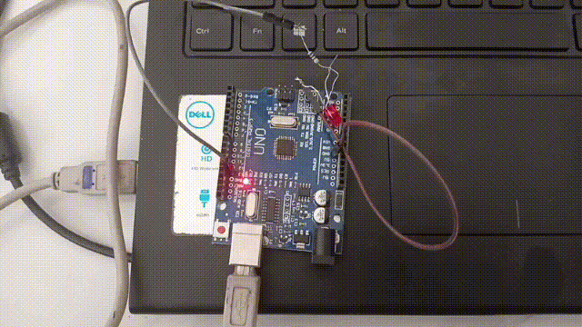

# Simulink Onramp Journey
Documentation of my transition from ECE theory to Model-Based Design. 

## 🚀 Featured Project: Falling Object Velocity Model
This model simulates a falling object subject to gravity and non-linear drag forces.

### 🔍 The "Ghost Connection" Debug
During the simulation, I encountered a logical discrepancy where the graph output showed an initial offset (starting at -7) despite the **Integrator Block's** initial condition being correctly set to 0. 

After verifying the internal parameters, I identified this as a **Platform Synchronization issue**. 

## 🛠️ Module 2: Mathematical Operators & Signal Routing
*Date:* April 26, 2026
*Environment:* Simulink Online / MATLAB Academy
*Hardware Notes:* Managed session during thermal throttling; utilized search shortcuts to optimize performance.

### 🟢 Task 1: Non-Linear Transformation (Square Root)
* *Objective:* Compute the square root of a time-varying ramp signal (u(t) = 2t).
* *Conceptual Insight:* Real-world physical systems (like fluid flow through an orifice) often follow non-linear square-root laws. This task models that transformation.
* *Implementation:* Integrated the Sqrt block from the Math Operations library.

### 🟢 Task 2 & 3: Constant Sources and Signal Referencing
* *Objective:* Implement a static reference signal (Setpoint) and verify signal flow.
* *Conceptual Insight:* In Control Systems, the *Constant Block* represents the "Desired State" or "Setpoint" (R(s)). Establishing a steady reference is the first step in building a closed-loop controller.
* *Implementation:* - Added a Constant block with a value of 3.
  - Routed signals to multiple Signal Assessment blocks for simultaneous verification.
-

---
## 🧠 Module 3: Decision Logic & Threshold Detection
**Date:** April 27, 2026  
**Environment:** Simulink Online / MATLAB Academy  
**Hardware Notes:** Successfully navigated a UI freeze (System Resilience Level: Expert) while monitoring thermal limits at 35°C.

### 🟢 Task 4: Strict Relational Mapping
* **Objective:** Implement a zero-crossing detector to convert a continuous Sine Wave into a binary logical state (1 or 0).
* **Conceptual Insight:** In Control Systems, precision at the boundary is everything. Moving from a non-strict `>=` to a strict `>` operator ensures the system only triggers when the signal is definitively positive—essential for timing in Power Electronics and safety interlocks.
* **Implementation:** Integrated the `Compare To Zero` block and verified strictly greater-than logic through the Signal Assessment suite.

![Boolean Logic Success]

---
### 🏎️ The "Gold" Connection: F1 & Industry
This logic mirrors the **DRS Activation** protocols used in Formula 1 (where a sub-millisecond boundary determines performance) and the **Force Feedback** safety loops in Japanese industrial robotics. Establishing these "logical eyes" is the first step toward building autonomous behavior.

Date: 29 April 2026
# 🚄 Project: Shinkansen Proximity Logic (The "Hidden Voice" Build)

## 📌 The Vision
Inspired by the precision of the Japanese Shinkansen, this project aims to bridge the gap between **Continuous Kinematics** and **Discrete Safety Logic**. This is my first official GitHub entry, documenting the transition from modeling motion to implementing reactive decision-making.

## 🛠️ The System Architecture
The goal was simple: Trigger a "Door Enable" signal ($Logic \ 1$) only when the train is within a $10m$ safety window of a $500m$ station mark.
### **Signal Chain:**
`Ramp (100m/s)` ➔ `Sum (+500, -Train)` ➔ `Absolute Value (|u|)` ➔ `Compare (< 10)` ➔ `Scope`.

---

## 🕵️‍♂️ The "Hidden Voice": A Debugging Odyssey
Every project has a hidden voice—the errors that tell you how the system *actually* works. I spent hours "listening" to these logic failures before achieving a successful trigger.

### **1. The Ghost Train (Square Root Trap)**
* **The Error:** Including a sqrt{u} block in the chain. 
* **The Discovery:** At t=15s (actual position 1500m), the sensor was seeing approx 38.7m. The train "mathematically" never reached the station. 
* **Lesson:** Unit consistency is the foundation of control theory.

### **2. The Door-Lock Failure (Negative Logic)**
* **The Error:** Using simple subtraction without Magnitude mapping.
* **The Discovery:** Once the train passed the station, the distance became negative. Since -500 < 10, the doors would remain open at high speeds!
* **Lesson:** Engineering requires accounting for boundary conditions. Implementing the **Absolute Value (`abs`)** block created the "Window Pulse" required for safety.

---

## 📊 The "Grand Finale" Result
The simulation successfully produced a precise pulse at $t=4.9s$, proving the safety interlock works exactly when the train hits the target window.
****model and results are given below:

----------------------------------------------------------------------------------------------------------------------------
Date:30 April 2026
###Project- The Wall of Air###
---Non-Linear Drag Modeling
""CONTEXT""
In 1955, the French BB9004 hit 331Km/hr , but the physics was brutal-the air resistance was so high it began melting the pantograph and the tracks. This Project is a "Simulink" simulation of that EXACT STRUGGLE: The battle between... Engine Thrust...&&& Non-Linear Aerodynamic Drag....^-^

####THE SYSTEM ARCHITECTURE.....
I built a "closed-loop Feedback System to model how air resistance grows with square of velocity(v^2).
####The MATHEMATICAL "LOGIC"
1) Summation: Fnet= Fthrust-Fdrag
2) The "vilian" (Drag): Fdrag = Cd.v^2
3) Turning : i iterated from a stress-test value of Cd=10 to Cd=5 to find a realistic "Saturation Curve".
   ---
   ***RESULTS***---> The Assymptotic Curve
   By extending the simulation to 1000 seconds , i captured the "saturation point" of the locomotive.
   1) Linear Phase(t<200s):The engine "dominates": "Acceleration" is nearly "constant".
   2) The "Knee"(t ~400s): The v^2 Feedback starts "Choking" , the "acceleartion".
   3) Terminal Velocity: The curve flattens at apprix 80m/sec (288 km/hr). At this point , the engine is no longer speeding up the train --- its just ---"Fighting the AIR."--------
      ***this PROJECT*** Proves the brute force power has a limit. In high speed systems, the "Wall of Air", eventually wins unless the system is  ***"streamlined"***. This simulation is the **bridge between Newtonian mechanics and control systems**
### Below are the model and results....

-----------------------------------------------------------------------------------------------------------------------------
🐱‍👤🐱‍👤🐱‍👤 Date : 02 May 2026
## The Model (pantograph) first seeing its Failure &&& then it 🐱‍👤 muscling up with the help of PID and Actuator ## 
**Phase 1: The "1982 TGV Failure" Scenario**
​This model replicates the critical failure point identified during early TGV speed trials attempting to cross the 380 km/h barrier. At these velocities, the wave speed of the catenary (overhead wire) approaches the train's speed, creating a "Sonic Boom" i.e critical velocity in catenary. $V_c = \sqrt{\frac{T}{\mu}}$ ​T = Tension of the wire (How tight it is pulled).
​mu = Linear mass density (How heavy the wire is per meter).
The Passive Failure: Without active control, the pantograph acted as a simple second-order mass-spring system.
​The Consequence: As shown in the "Failing System" scope, the mechanical resonance caused the head to bounce completely off the wire (Zero-Crossings). This resulted in massive electrical arcing, localized melting of the contact strip, and immediate power loss. Effecting the wire.

🐱‍🐉**The Problem: A standard mass-spring-damper setup.**
​Mass (M): 8 kg (Contact Head)
​Stiffness (K): 100 N/m
​Disturbance: Band-limited White Noise (Simulating wire jitter at high velocity).

## THE MODEL AND RESULTS ARE HERE (For PHASE 01)##

---------------------------------------------------------------------------------------------------------------------------
☆*: .｡. o(≧▽≦)o .｡.:*☆☆
**Engineering Rule: To go faster, you must either increase the tension or decrease the wire's weight. My PID controller helps the pantograph "survive" as the train approaches this limit**

😎 Phase 2: The "Savage" PID Correction 
​To solve the instability, I implemented a Closed-Loop Feedback Controller mimicking the active pneumatic actuators used in 3rd Gen TGVs.
​The Control Logic:
​**Error Detection: e(t) = {Target Height} (0.7) - {Actual Height}.**
​**PID Processing: Proportional: Instantaneous response to wire displacement.**
​**Integral: Eliminates steady-state error caused by aerodynamic lift.**
​**Derivative: The "Braking" force that predicts and kills high-frequency oscillation.**
---------------------------------------------------------------------------------------------------------------------------
​***✔The Result: The "Chaos" of the first model is suppressed. The system achieves a stable Step Response with a controlled maximum overshoot, settling into a flat line at 0.7m. This ensures 100% contact reliability even under high-noise conditions.***

​ **Tech Stack & Engineering Concepts**
👾​Simulink: Dynamic system modeling & ODE solving.
👾​Control Theory: PID Tuning, Stability Analysis, Disturbance Rejection.
​Railway Engineering: High-speed pantograph-catenary interaction physics.
## 🐱‍👤THE MODEL AND RESULTS ARE HERE (For PHASE 02) ##

------
---

## 🛠️ Integrated Hardware Development (Arduino Uno R3)
Expanding the project scope from simulations to physical hardware-in-the-loop (HIL) testing. 

### 🚥 Module 01: System Status & Timing Control
Verified the operational logic for the Casino Game heartbeat using an external LED. This ensures the timing sequences for game states are accurate before full integration.

#### Hardware in Action

**Technical Highlights:**
* **Controller:** Arduino Uno R3 (ATmega328P)
* **Execution:** Synchronized 10-cycle blink sequence at 250ms intervals.
* **Architecture:** Modular file structure for isolated hardware verification.

